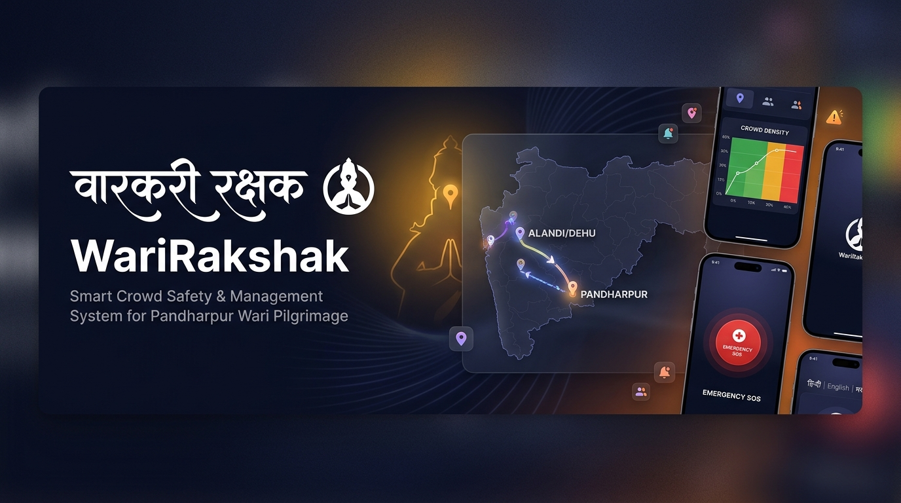
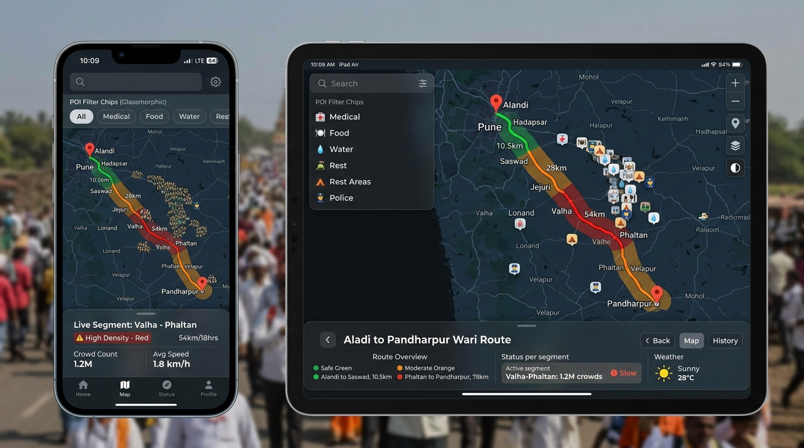
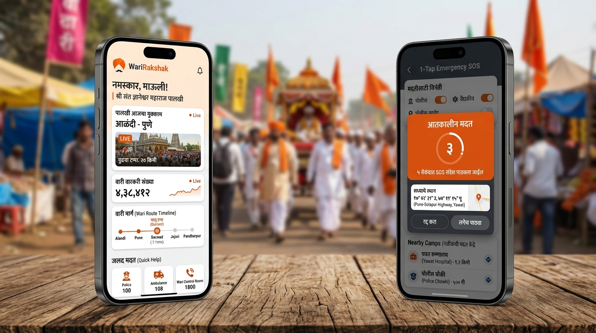
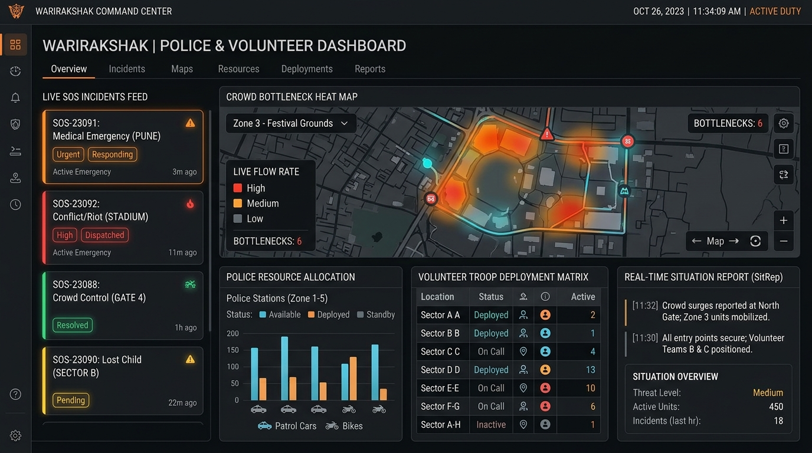
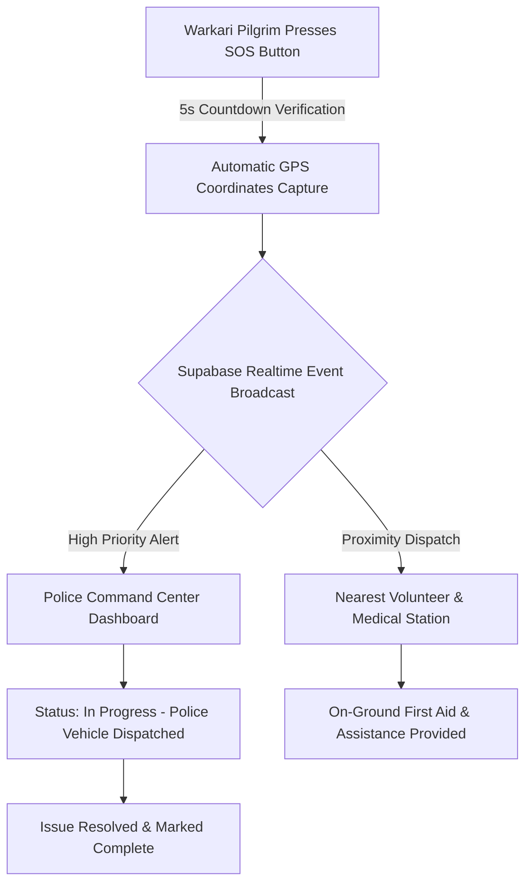

<div align="center">


# 🚩 वारकरी रक्षक (WariRakshak)
### *Smart Crowd Safety, Real-Time Pilgrimage Tracking & Tactical Emergency Response System*

[](https://pandharpurwari-gray.vercel.app/)
[](https://react.dev/)
[](https://vitejs.dev/)
[](https://tailwindcss.com/)
[](https://leafletjs.com/)
[](https://supabase.com/)
[](https://pandharpurwari-gray.vercel.app/)

<br />



<br />

**[🌐 Experience the Live Application](https://pandharpurwari-gray.vercel.app/)** • **[📖 User Guide](#-key-features)** • **[🛠️ Tech Stack](#️-tech-stack)** • **[🚀 Quickstart](#-getting-started)**

</div>

---

## 📖 Overview

**वारकरी रक्षक (WariRakshak)** is a modern, high-performance crowd safety and pilgrimage management web application built specifically for the historic **Pandharpur Ashadhi Wari** pilgrimage in Maharashtra, India. Every year, millions of *Warkaris* walk over 250+ kilometers along sacred Palkhi routes from **Alandi (Sant Dnyaneshwar Maharaj)** and **Dehu (Sant Tukaram Maharaj)** to **Pandharpur**.

WariRakshak addresses critical logistical and safety challenges by combining **real-time GIS route maps**, **color-coded crowd congestion telemetry**, **1-Tap Emergency SOS dispatch**, and **role-tailored tactical dashboards** for Pilgrims, Police authorities, and On-ground Volunteers.

---

## 🌟 Live Deployment

> 🔗 **Production URL:** [https://pandharpurwari-gray.vercel.app/](https://pandharpurwari-gray.vercel.app/)  
> Deployed seamlessly with Vercel edge network, providing instant access and sub-second load times across mobile devices on 4G/5G pilgrimage routes.

---

## 📸 Visual Showcase & Screenshots

### 1. 🗺️ Interactive Live GIS Crowd Map & POI Radar
Real-time congestion tracking across each Palkhi route segment with smart filtering for emergency medical camps, Annachhatra (free meals), drinking water tankers, mobile sanitation facilities, and police chowkis.

<div align="center">
  
</div>

---

### 2. 📱 Pilgrim Companion & 1-Tap Emergency SOS
Tailored mobile-first interface for Warkaris featuring live Palkhi current stop timeline, total pilgrim counter, 5-second cancelable SOS trigger with automatic GPS coordinate sharing, and emergency helpline dialers.

<div align="center">
  
</div>

---

### 3. 🛡️ Police & Volunteer Tactical Command Center
Command dashboard for law enforcement and emergency response coordinators with live SOS incoming incident queues, troop deployment matrices, bottleneck heatmaps, and situational status reports (SitRep).

<div align="center">
  
</div>

---

## ⚡ Key Features

### 👤 Role-Based Portals & Dashboards
* **Warkari / Pilgrim Portal:** Interactive route timeline, distance to Pandharpur, real-time safety advisories, and direct helpline access.
* **Police Tactical Portal:** Instant SOS dispatch tracker with status workflow (`Pending` ➔ `In Progress` ➔ `Resolved`), police station resource allocation, and crowd bottleneck monitoring.
* **Volunteer Portal:** Sector-wise troop deployment management, local medical assistance coordination, and lost-and-found support.

### 🗺️ Smart Crowd Density & Route Tracking
* **Multi-Route Switcher:** Toggle between **Sant Dnyaneshwar Maharaj Palkhi Route** (via Saswad, Jejuri, Lonand, Phaltan) and **Sant Tukaram Maharaj Palkhi Route** (via Loni Kalbhor, Yawat, Patas, Baramati, Indapur).
* **Dynamic Congestion Telemetry:** Color-coded route segments:
  - 🟢 **Safe / Free Flow (Green)**: Optimal movement speed.
  - 🟠 **Moderate Density (Orange)**: Heavy foot traffic; caution advised.
  - 🔴 **High Congestion / Bottleneck (Red)**: Severe surge; alternate paths suggested.
* **Point of Interest (POI) Filters:** Filter nearest Drinking Water 💧, Medical Centers 🏥, Annachhatra (Food) 🍲, Rest Tents ⛺, Washrooms 🚻, and Police Assistance 👮.

### 🚨 1-Tap Emergency SOS System
* Floating one-tap emergency button always accessible.
* 5-second countdown with sound/haptic feedback to prevent false alarms.
* Sends exact latitude/longitude, user contact, and medical requirements directly to the police command desk.
* Instant one-touch direct phone dialers for Police (`100`), Ambulance (`108`), Women Helpline (`1090`), and Wari Control Room (`1800-233-1080`).

### 🌐 Trilingual Localization (i18n)
* **मराठी (Marathi)** — Native spiritual and devotional experience for Warkaris.
* **हिंदी (Hindi)** — Accessible for pilgrims traveling from neighboring regions.
* **English** — Universal interface for administrative staff and visitors.

### 🎨 Premium UI & Spiritual Theme Aesthetics
* Authentic cultural palette featuring **Saffron (`#FF7A00`)**, Vitthal-inspired accents, and glassmorphism.
* Full **Dark Mode** and **Light Mode** support with smooth animated transitions powered by `framer-motion`.

---

## 🛠️ Tech Stack & Architecture

| Layer | Technologies Used |
| :--- | :--- |
| **Frontend Framework** | [React 18](https://react.dev/) + [Vite 5](https://vitejs.dev/) |
| **Styling & Design** | [Tailwind CSS 3](https://tailwindcss.com/) + Custom Glassmorphic System |
| **Mapping & GIS** | [Leaflet](https://leafletjs.com/) + [React-Leaflet](https://react-leaflet.js.org/) + OpenStreetMap |
| **Animations** | [Framer Motion](https://www.framer.com/motion/) |
| **Icons** | [Lucide React](https://lucide.dev/) |
| **State & Backend** | [Supabase](https://supabase.com/) (PostgreSQL & Realtime Events) + React Context API |
| **Internationalization** | [i18next](https://www.i18next.com/) + `react-i18next` + Language Detector |
| **Deployment & CI/CD** | [Vercel](https://vercel.com/) Edge Hosting |

---

## 📁 Project Structure

```bash
Wari/
├── public/
│   ├── screenshots/             # High-res demo screenshots & mockups
│   ├── logo.png                 # WariRakshak emblem
│   └── language_bg.jpg          # Cultural heritage background
├── docs/
│   └── screenshots/             # Documentation visuals
├── src/
│   ├── components/              # Reusable UI & GIS components
│   │   ├── BottomNav.jsx        # Mobile navigation bar
│   │   ├── CrowdMap.jsx         # Core Leaflet GIS interactive map
│   │   ├── SOSButton.jsx        # 1-Tap Emergency SOS trigger modal
│   │   ├── SplashScreen.jsx     # Animated splash loading screen
│   │   ├── TopHeader.jsx        # Header with language/theme switchers
│   │   └── ThemeToggle.jsx      # Dark/Light mode toggle
│   ├── context/
│   │   ├── AuthContext.jsx      # Role-based authentication state
│   │   └── ThemeContext.jsx     # Dark / Light theme provider
│   ├── hooks/
│   │   ├── useCrowdDensity.js   # Live route density & milestone telemetry
│   │   ├── usePOI.js            # POI facilities data hook
│   │   └── useSOSAlerts.js      # Real-time SOS alerts subscription
│   ├── lib/
│   │   ├── i18n.js              # i18next translation configuration
│   │   ├── mockData.js          # Comprehensive Palkhi milestones & POIs
│   │   └── supabaseClient.js    # Supabase backend client
│   ├── locales/
│   │   ├── mr.json              # Marathi translations
│   │   ├── hi.json              # Hindi translations
│   │   └── en.json              # English translations
│   ├── pages/
│   │   ├── auth/                # Login, Registration & Language Selection
│   │   ├── dashboards/          # Pilgrim, Police, and Volunteer dashboards
│   │   ├── tactical/            # SitRep, SOS Streams & Station Info
│   │   └── warkari/             # Home, Map, Helpline & Profile views
│   ├── App.jsx                  # Main application router
│   ├── main.jsx                 # Entry point
│   └── index.css                # Tailwind directives & custom CSS tokens
├── package.json
├── tailwind.config.js
├── vite.config.js
└── README.md
```

---

## 🚀 Getting Started

Follow these steps to set up and run WariRakshak on your local development machine:

### 1. Prerequisites
- **Node.js** (v18.0.0 or later recommended)
- **npm** or **yarn** / **pnpm**

### 2. Clone the Repository
```bash
git clone https://github.com/satyambro03/Pandharpur-Wari.git
cd Pandharpur-Wari
```

### 3. Install Dependencies
```bash
npm install
```

### 4. Environment Configuration (Optional)
Create a `.env` file in the root directory if connecting to a custom Supabase instance:
```env
VITE_SUPABASE_URL=your_supabase_project_url
VITE_SUPABASE_ANON_KEY=your_supabase_anon_key
```
*(Note: If no custom backend is provided, the application gracefully utilizes built-in offline telemetry and fallback data).*

### 5. Launch Development Server
```bash
npm run dev
```
Open [http://localhost:5173](http://localhost:5173) in your browser.

### 6. Build for Production
```bash
npm run build
```
To preview the production build locally:
```bash
npm run preview
```

---

## 🛡️ Emergency Safety Protocols & Workflow



---

## 🤝 Contributing

Contributions, feedback, and feature suggestions are welcome!

1. Fork the repository (`https://github.com/satyambro03/Pandharpur-Wari/fork`).
2. Create your Feature Branch (`git checkout -b feature/AmazingFeature`).
3. Commit your Changes (`git commit -m 'Add some AmazingFeature'`).
4. Push to the Branch (`git push origin feature/AmazingFeature`).
5. Open a Pull Request.

---

## 📄 License

This project is open-source and available under the [MIT License](LICENSE).

---

<div align="center">
  <sub>Made with devotion and technology for the millions of Warkari pilgrims. 🚩 <b>राम कृष्ण हरी!</b></sub><br />
  <sub>Deployed with ❤️ on <a href="https://pandharpurwari-gray.vercel.app/">Vercel</a></sub>
</div>
